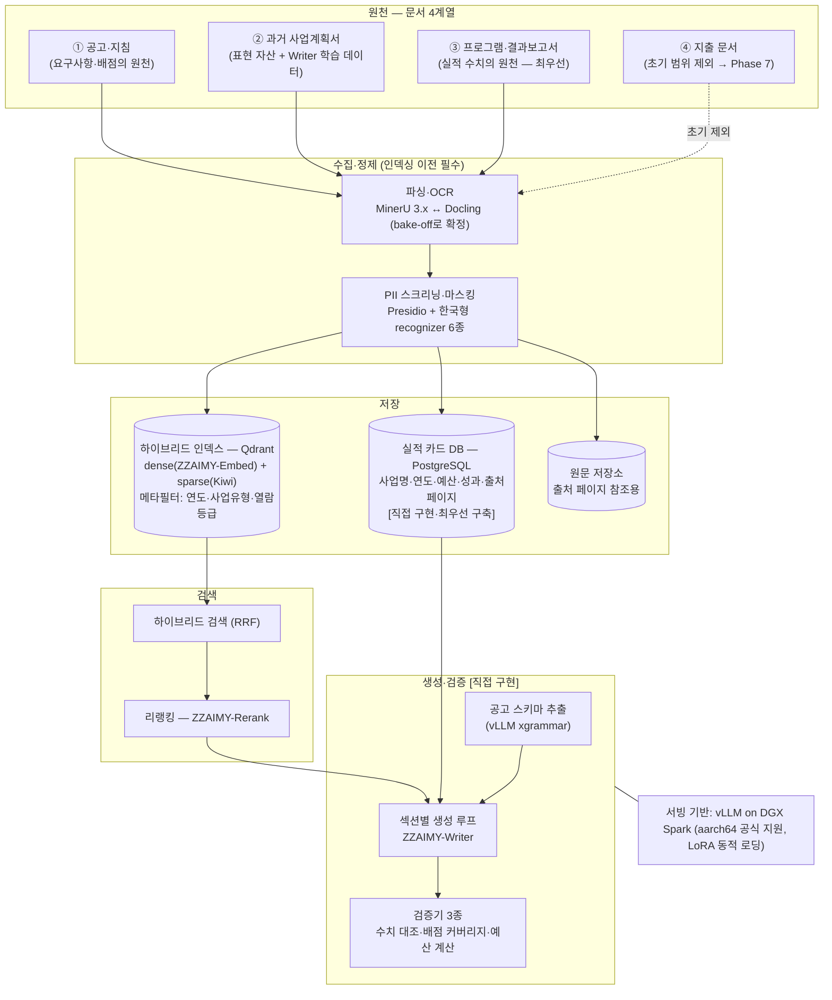
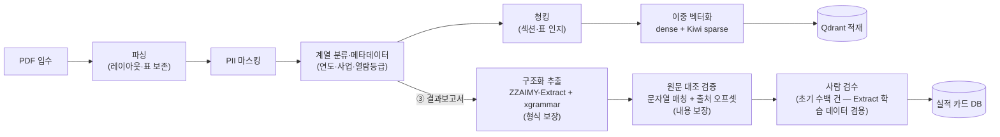
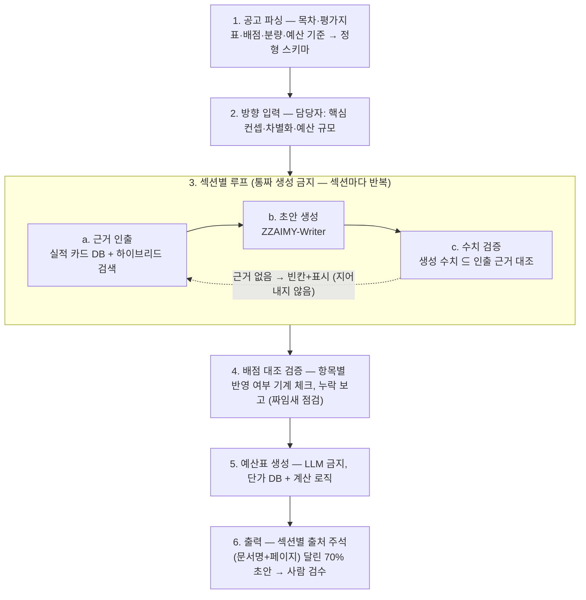
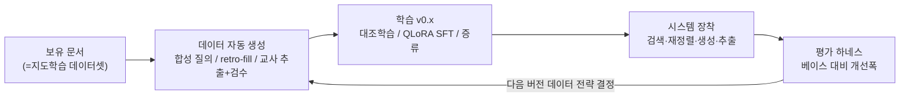
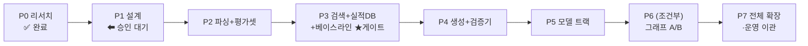

# 02. 시스템 조감도 — 구성·프로세스·유즈케이스

> 작성일: 2026-08-15 (Phase 0 종료 시점)
> Phase 0 리서치 결과(00-summary)와 브리프 6장을 합쳐 시스템 전체 그림을 개념 수준으로 정리한 문서.
> 정식 명세는 Phase 1의 `docs/architecture.md`에서 확정한다. 표기 규칙: **[직접 구현]** = 도메인 고유 로직(나머지는 오픈소스 조립).

---

## 1. 전체 구성

- 색 대신 역할로 읽는다: **날실 = 공고·요구사항 계열(①, 스키마)**, **씨실 = 실적·근거 계열(②③, 실적 카드·검색)**. 생성은 둘이 교차하는 지점에서만 일어난다.
- 기술 선정 근거는 전부 `00-summary.md`. 미확정 2건 — 파서(bake-off), 벡터 스토어(Qdrant vs pgvector, Phase 1 결정).

## 2. 구축 파이프라인 (배치)

문서를 시스템 자산으로 바꾸는 공정. 공통 정제 후 두 경로로 분기하며, **문서 단위 완전 병렬**(Spark 최대 20대 독립 워커 — 클러스터링 금지).

## 3. 생성 루프 — 공고에서 초안까지

시스템의 심장(브리프 6장). 4번 배점 대조가 차별화 지점 — 사람이 가장 자주 놓치는 것을 기계가 가장 잘 잡는다.

## 4. 유즈케이스

| ID | 액터 | 유즈케이스 | 입력 → 출력 |
|---|---|---|---|
| **UC-1** | 사업 담당자 | **공고 대응 초안 생성** (핵심) | 공고 PDF+방향 → 출처 주석 초안 + 배점 커버리지 보고 |
| UC-2 | 사업 담당자 | 실적·근거 탐색 | 자연어 질의 → 실적 카드 + 원문 출처 페이지 |
| UC-3 | 사업 담당자 | 짜임새 점검 (검증기 단독) | 작성 중 초안+공고 → 항목별 반영/누락 체크리스트 |
| UC-4 | 문서·실적 관리자 | 문서 등재·배치 처리 | PDF 일괄 → 인덱스·실적 카드 갱신 + 처리 리포트 |
| UC-5 | 문서·실적 관리자 | 실적 카드 검수 | 추출 JSON+원문 하이라이트 → 확정 카드 (=Extract 학습 데이터) |
| UC-6 | 구축·모델 담당 | 학습·평가 사이클 (축 B) | 문서 자산 → ZZAIMY-* v0.x + 개선폭 보고서 |
| UC-7 | 구축·모델 담당 | 운영 서버 사양 산정 | Phase 1~4 실측 로그 → 요구사양 보고서 |

## 5. 축 B — 데이터 플라이휠

| 모델 | 베이스(1안) | 학습 | 핵심 지표 |
|---|---|---|---|
| ZZAIMY-Embed | KURE-v1 (MIT) | 대조학습 + 하드 네거티브 | Recall@k · MRR · nDCG |
| ZZAIMY-Rerank | bge-reranker-v2-m3 | cross-encoder (Embed 데이터 재활용) | 리랭킹 후 Recall@k |
| ZZAIMY-Writer | Qwen3.5-35B-A3B (MoE) | QLoRA 섹션 SFT — **출력 수치 ⊆ 입력 근거** 아니면 폐기 | **수치 환각률 0 수렴** · 평가지표 반영률 |
| ZZAIMY-Extract | Qwen3-4B | 교사 증류 SFT + xgrammar 이중 보증 | 필드 F1 · 처리량 배수 |

절대 규칙: 지식 주입 금지(능력 학습만) · Phase 3 베이스라인 측정 후에만 학습 시작.

## 6. 하드웨어 배치

| 구간 | 장비 | 용도 | 원칙 |
|---|---|---|---|
| 개발·서빙 | DGX Spark ×1 | 프로토타입·대화형 서빙 | vLLM 단일 스택, MoE 우선(대역폭 ~273GB/s) |
| 배치·학습 | DGX Spark ×최대 20 | 파싱·추출·임베딩·학습 | **문서 단위 병렬 — 분산 추론 클러스터링 금지** |
| 운영 서버 | 미구매 | — | 사양 가정 금지, Phase 1~4 실측으로 산정 |

전 구간 온프레미스 — 문서는 외부 API로 전송하지 않는다.

## 7. 로드맵 (현재 위치: Phase 0 완료 → Phase 1 승인 대기)

- 각 Phase 종료 시 사용자 보고·승인 후 진행(브리프 12장).
- ★게이트: Phase 3 베이스라인 측정을 건너뛰면 축 B 성과 입증 불가 — 순서 변경 금지.
- 파일럿 우선: 최근 3~5년 계획서 20~30건 + 대응 결과보고서로 시작, 수만 장 전체는 Phase 7.
